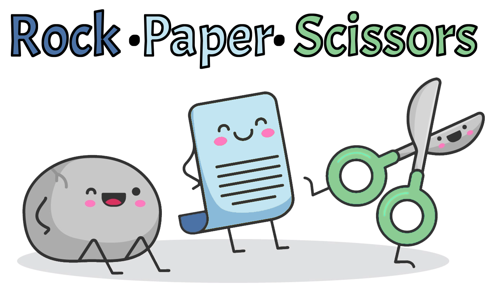
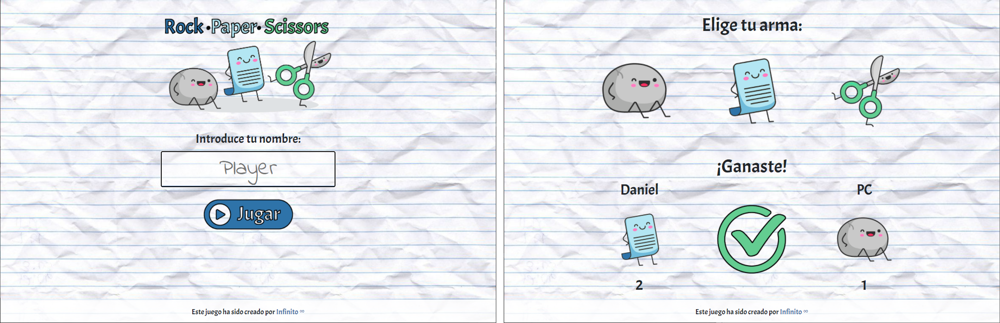

# Piedra papel tijetas

## Descripción

Juego clásico de piedra papel o tijeras. Compite el jugador contra la máquina, ganando la partida el primero que venza en 3 rondas.

La aplicación sigue los principios del diseño responsive, está en formato ordenador y móvil. Utiliza ventanas modales para mostrar los eventos de juego e incorpora sonidos al pulsar en los botones y al acabar la partida. Permite poner el nombre del jugador y lo muestra por pantalla.

## Caracerísticas

* HTML5, CSS3, JS
* Archivos de audio
* Animaciones

## Colaboraciones

